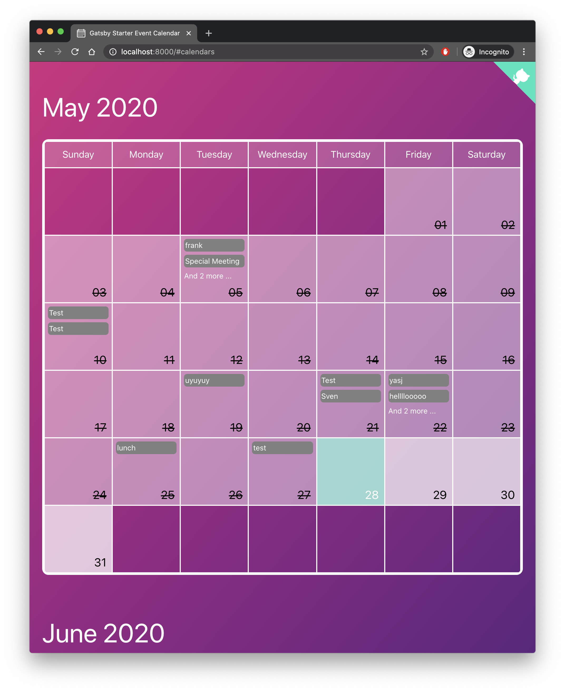
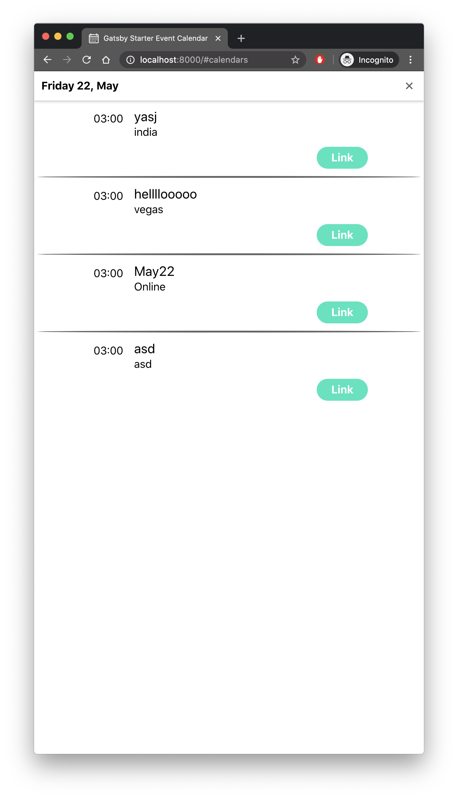

# Gatsby Starter: Event Calendar 📅

[](https://travis-ci.com/EmaSuriano/gatsby-starter-event-calendar)
[](https://eslint.org/)
[](https://github.com/prettier/prettier)
[](https://app.netlify.com/sites/gatsby-starter-event-calendar/deploys)


> A customizable calendar event starter for Gatsby integrated with Google Spreadsheet.

The target audiences are Event Organizers or Meetups 😄

### [Demo 🎉](https://gatsby-starter-event-calendar.netlify.com/)

## Why? 🤔

Have you ever manage multiple events at the same time that you have to share with people? It can be a hard task, due to all the possible things that can happen: new events, changes of date or someone remove/cancel his event. This starter is to help you with that!

People can submit new events via Google Form, which are stored inside a Google Spreadsheet and then displayed them inside the UI. As the only way of adding events is Google Form, this is a 100% collaborative application with the power of editing the entries by the owner or by you (the Admin).

## Features 🛠

- [Gatsby](https://www.gatsbyjs.org/)
- [Grommet](http://grommet.io): A react-based framework that provides accessibility, modularity, responsiveness, and Theming in a tidy package
- Dynamic content from [Google Spreadsheet](https://www.google.com/sheets/about/)
- Offline support
- Typescript
- React Hooks
- A11y support: content and navigation ready for screen readers.
- PWA ready
- SEO
- Responsive design
- Icons from [grommet-icons](https://github.com/grommet/grommet-icons)
- [Netlify](https://www.netlify.com) Deployment Friendly
- Developer tools:
  - eslint
  - prettier

## How to start ▶️

I wrote an article about this project where I explained these steps in a better way with images and the reason behind every step. [Link to the Article](https://emasuriano.com/blog/building-a-collaborative-calendar-with-google-and-gatsby).

If you never used Gatsby before, I highly recommend you to [set up your development environment](https://www.gatsbyjs.org/tutorial/part-zero/)!

Use the Gatsby CLI to get the code of the starter:

```bash
$ gatsby new event-calendar https://github.com/EmaSuriano/gatsby-starter-event-calendar
```

The main data source of this starter is a Google Spreadsheet linked with a Google Form, so the first thing we have to do is [create one](http://forms.new). Here you can create the questions that the user have to complete to submit the form, in my case I have the following structure:


**The text you pick for all the questions can differ from mine, then I will explain how to adapt the starter for your questions**

Once the form is created, you need to generate a Spreadsheet from it. For that, move to the Responses Tab and click on the green Spreadsheet logo which says "View Responses in Sheets". This will create a Spreadsheet that will be automatically updated when someone makes a new entry inside the form. This will be the source of the application.

Next, you need to have access from the application to read the Spreadsheet. You need to navigate to your [Google API Dashboard](https://console.developers.google.com/apis/dashboard) and then go to Credentials which is on the left panel. There you click on "Create credentials" and add a new Service account key.

You'll be redirected to a new page to create the service account key, just make sure the option of "App Engine default service account" is selected and the key type marked as JSON. Click on the Create button and you will download a JSON file with your credentials, copy the value of `client_email` and share the spreadsheet with that mail, and that's it! This is how you enable to read the document from an external application 🎉

The last step is to configure our application to know from where it has to fetch the data, this is going to be made by using `environment variables`. You need to create a file called `.env` inside the root of the directory, with the following structure:

```javascript
PRIVATE_KEY=// your private_key
PRIVATE_KEY_ID=// your private_key_id
PROJECT_ID=// your project_id
```

Then go to `gatsby-config.js` and look for the options of `gatsby-source-google-sheets`, and change the values of:

- `spreadsheetId`: you can find this value inside the URL of the spreadsheet. `https://docs.google.com/spreadsheets/d/[spreadsheetId]`
- `worksheetTitle`: this is the name of the sheet from which you want to read the information.

Now you are ready to start the project, fetching all the events inside the Spreadsheet and displaying Calendars with them!

```bash
> yarn start
```

## Mapping your question with Query structure

Gatsby will retrieve all the information inside the Spreadsheet and hosted inside a GraphQL server that you can access from anywhere inside your project by using the concept of `StaticQuery`. They are called static because they are evaluated **only** during build time.

Graphql queries have a concept called `alias` that allows renaming a variable the query, and this is exactly what you need to properly map all the questions. This is the example Query:

```graphql
query eventsQuery {
  allGoogleSheetEventsRow {
    edges {
      node {
        id
        eventName: whatisthename
        date: when
        eventLink: linktotheevent
        place: where
      }
    }
  }
}
```

The important part here it's that you have to use the **same** names on the left part of the query.

The name of the variables of your spreadsheet will be same as your columns, which are a short version of the question (removing caps, spaces, and symbols). If your questions was "Provide a name", then your variable inside the Query will be `provideaname`, and you need to map it as `eventName: whatisthename`.

One more thing if you've never worked with Gatsby before, it provides a [Graphql playground](http://localhost:8000/___graphql) where you can try your queries without the overhead of recompiling the project.

## Responsiveness

| Desktop                                          | Tablet                                         | Mobile                                         |
| ------------------------------------------------ | ---------------------------------------------- | ---------------------------------------------- |
|        |        |        |
|  |  |  |

## App Configuration

Inside the root folder, there is a file called `appConfig.js`, which allows you to customize the starter with your own preferences. It has the following structure:

```json
{
  "title": "Gatsby Starter Event Calendar",
  "subTitle": "The easiest option to share events!",
  "formLink": "https://goo.gl/forms/u00WBxeK1kQco0uQ2",
  "limitMonthInTheFuture": 2,
  "theme": {}
}
```

All these values can be changed by the developer and in case one of them it's not defined they all have default values. Inside the application, these values are being accessed using the component called `ConfigContext` which is a basic implementation of `React Context`.

## Theming 🎨

`Grommet` has a prop called theme when the developer can set all the colors that are going to be used inside the application. Therefore there are some `standard` colors, like `background` and `text`, but there is a whole object just to configure how the Calendar is going to look like.

You can change any of the existing themes or create your own following this structure:

```json
{
  "background": "linear-gradient(to right bottom, #d22780, #b82283, #9b2085, #7e2183, #5e227f)",
  "brand": "#1fe5bd",
  "secondary": "#41a7b3",
  "focus": "#1fe5bd",
  "text": "white",
  "border": "white",

  "calendar": {
    "today": {
      "background": "#9af1daDD",
      "text": "white",
      "border": "white"
    },
    "day": {
      "background": "#ffffffbb",
      "text": "black",
      "border": "white"
    },
    "past": {
      "background": "#ffffff73",
      "text": "black",
      "border": "white"
    },
    "empty": {
      "background": "transparent",
      "border": "white"
    },
    "weekdays": {
      "background": "#ffffff22",
      "border": "white"
    },
    "event": {
      "background": "#1fe5bdDD",
      "text": "white"
    },
    "past-event": {
      "background": "#666",
      "text": "white"
    },
    "modal": {
      "text": "black",
      "separator": "#666",
      "background": "white"
    }
  }
}
```

Inside the folder [themes](./themes) you can find a few examples I made to show how colorful your calendar can be!

| Main                              | Light                               | Dark                              |
| --------------------------------- | ----------------------------------- | --------------------------------- |
|  |  |  |

## Building your site 📦

Change the name of the variables of below to 3 this project is using.

As we are dealing with environment variables, the `.env` file is excluded from `.gitignore` file. Therefore, in order to deploy the website you have to send `PRIVATE_KEY`, `PRIVATE_KEY_ID` and `PROJECT_ID` with the `build` command.

```bash
PRIVATE_KEY=xxxxx PRIVATE_KEY_ID=yyyyy PROJECT_ID=wwwww yarn build
```

The result will be stored inside the `public` folder so you can upload to your web host. I highly suggest using this starter with Netlify when you can define which command will build the project and also send the environment variables inside the website configuration 👌

## Automatic deployment on new Event ⚡️

As Gatsby produce static websites you need to make a new deploy of the website in order to show the new events from the Events Spreadsheet.

When it comes to deployment there are many alternatives, like Github Pages, Netlify, Heroku and many many more. Independently of which one you choose, none of them has the ability to _watch_ for changes inside our Spreadsheet, and they shouldn't because it's not their job.

To address this problem I used [Zapier](https://zapier.com/), which allows to define flows of action inside your application. Defining a Trigger (something that needs to happen) and actions (what should happen after).

For this project, the rule is: If someone adds/edits/removes a new event, trigger a new deploy. And this it looks in Zapier 😄


## Contributing 💪

I came with the idea of creating this starter after making a page for a friend with the same concept but it was totally attached to only one spreadsheet and lots of hardcoded information.

I'm totally for new PRs with bug fixes, change in Documentation, and new features to the starter 🙌

## License 📝

MIT.
